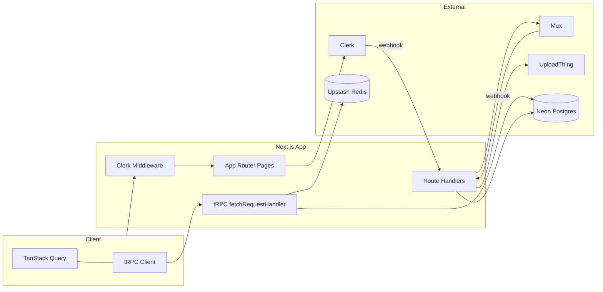

# NewTube — 학습용 프로젝트 가이드

YouTube와 유사한 동영상 플랫폼을 **Next.js 15(App Router)**, **tRPC**, **Drizzle ORM**, **Clerk**, **Mux**, **UploadThing**, **Neon**, **Upstash** 등으로 구현한 풀스택 예제입니다. 앞부분은 **개념·구조·학습 순서**를 한국어로 풀어 쓴 본문이고, 마지막 **[부록](#부록-코드-및-다이어그램-레퍼런스)**에서는 같은 내용을 **코드 인용·Mermaid·표**로 다시 정리합니다(설명은 한국어, 패키지·코드 식별자는 원문 유지).

---

## 목차 (한국어)

1. [이 프로젝트가 보여 주는 것](#1-이-프로젝트가-보여-주는-것)
2. [기술 스택을 왜 이렇게 쌓았는가](#2-기술-스택을-왜-이렇게-쌓았는가)
3. [요청이 흐르는 길](#3-요청이-흐르는-길)
4. [폴더 구조 읽는 법](#4-폴더-구조-읽는-법)
5. [데이터베이스 설계 포인트](#5-데이터베이스-설계-포인트)
6. [핵심 코드 패턴](#6-핵심-코드-패턴) (하위: [Zod로 입력 검증](#zod로-입력-검증), [낙관적 업데이트](#낙관적-업데이트), [인피니티 스크롤](#인피니티-스크롤))
7. [웹훅과 업로드, 백그라운드 작업](#7-웹훅과-업로드-백그라운드-작업)
8. [환경 변수와 로컬 실행](#8-환경-변수와-로컬-실행)
9. [추천 학습 로드맵](#9-추천-학습-로드맵)
10. [부록: 코드 및 다이어그램 레퍼런스](#부록-코드-및-다이어그램-레퍼런스)

---

## 1. 이 프로젝트가 보여 주는 것

| 영역 | 구현 내용 |
|------|-----------|
| **인증·세션** | Clerk로 로그인/회원가입. 서버에서는 `auth()`로 `userId`를 얻고, 앱 전용 `users` 테이블과 조인해 내부 UUID를 씁니다. |
| **사용자 동기화** | Clerk **웹훅**(`src/app/api/users/webhook/route.ts`)이 `user.created` 등 이벤트마다 Postgres `users` 행을 insert/update/delete 합니다. Svix로 서명을 검증합니다. |
| **영상 파이프라인** | Mux에 업로드·인코딩을 맡기고, **Mux 웹훅**으로 `videos` 테이블의 `mux_*` 필드를 갱신합니다. 재생 UI는 `@mux/mux-player-react`를 사용합니다. |
| **API 계층** | REST 대신 **tRPC**: 서버의 `procedure`가 클라이언트에서 타입까지 그대로 따라옵니다. HTTP 엔드포인트는 사실상 `/api/trpc` 하나에 배치 링크로 묶입니다. |
| **목록·무한 스크롤** | 여러 화면이 **`useInfiniteQuery` / `useSuspenseInfiniteQuery`** 와 **`nextCursor`** 로 페이지를 이어 받고, `InfiniteScroll`·IntersectionObserver로 자동 로드(또는 Load More)합니다. 뮤테이션 UI는 **낙관적 업데이트 없이** `invalidate`로 동기화합니다. |
| **데이터 접근** | **Drizzle ORM**으로 스키마를 TypeScript에 두고, `drizzle-zod`로 insert/select용 Zod 스키마를 생성해 입력 검증과 공유합니다. |
| **보호·남용 방지** | `protectedProcedure` 안에서 Upstash Redis **슬라이딩 윈도우** 레이트 리밋을 적용합니다(`src/lib/ratelimit.ts`). |
| **이미지 업로드** | UploadThing으로 배너·썸네일 등을 올리고, 완료 시 DB URL/키를 갱신합니다(`src/app/api/uploadthing/core.ts`). |
| **백그라운드** | Upstash Workflow(QStash)로 영상 관련 HTTP 워크플로를 호출하며, 일부 단계에서 OpenAI API를 사용합니다(`src/app/api/videos/workflows/*`). |

---

## 2. 기술 스택을 왜 이렇게 쌓았는가

### Next.js 15 + React 19

- **App Router**는 `src/app/.../page.tsx`가 URL이 되고, `layout.tsx`로 레이아웃을 중첩합니다.
- **Route Group** `(home)`, `(studio)`, `(auth)`는 괄호 폴더라 **URL에 포함되지 않고** 레이아웃만 나눕니다.
- **Server / Client Component** 경계: `"use client"`가 붙은 파일에서만 React 훅·tRPC 훅을 씁니다. 루트 `layout.tsx`는 서버 컴포넌트이지만, 그 안에 `TRPCProvider` 클라이언트 컴포넌트를 자식으로 둡니다.

### tRPC + TanStack Query + SuperJSON

- tRPC는 **엔드포인트 문자열 대신** `trpc.videos.xxx.useQuery()`처럼 **함수 호출**처럼 쓰게 해 줍니다. `AppRouter` 타입 하나로 서버·클라이언트가 맞물립니다. 목록은 **`useInfiniteQuery` / `useSuspenseInfiniteQuery`** 로 페이지를 이어 붙일 수 있습니다(아래 [인피니티 스크롤](#인피니티-스크롤)).
- TanStack Query는 캐시·리페치·로딩 상태를 담당합니다. 이 저장소의 뮤테이션은 **낙관적 업데이트 없이** 성공 후 `invalidate`로 맞추는 편입니다([낙관적 업데이트](#낙관적-업데이트)).
- JSON은 `Date` 같은 타입을 잃어버리므로 **SuperJSON** transformer로 직렬화 규칙을 통일합니다(서버 tRPC 설정과 클라이언트 `httpBatchLink` 모두 동일하게).

### Drizzle + Neon

- `drizzle-orm/neon-http`는 **서버리스/엣지 친화적**으로 Postgres에 HTTP로 붙는 패턴입니다(`src/db/index.ts`).
- 스키마는 `src/db/schema.ts` 한곳에 모아 **관계(relations)·enum·복합 PK**를 코드로 읽을 수 있게 합니다.

### Clerk

- 브라우저 세션과 미들웨어 `auth.protect()`가 **라우트 단위 보호**를 담당합니다.
- DB의 `users.clerkId`는 Clerk의 사용자 id와 매핑됩니다. 웹훅이 없으면 DB에 행이 없어 `protectedProcedure`가 실패할 수 있습니다.

### Mux + UploadThing

- Mux는 **스트리밍 인프라**(업로드, 트랜스코딩, 재생 URL)를 담당합니다.
- 썸네일·배너처럼 **정적 이미지**는 UploadThing에 두고 URL을 DB에 저장하는 **일반적인 분업**입니다. Mux 웹훅 처리에서 생성된 임시 이미지 URL을 UploadThing으로 다시 올리는 흐름도 있습니다.

### Radix UI + Tailwind + shadcn 스타일

- `src/components/ui` 아래는 접근성 있는 프리미티브(Radix) 위에 Tailwind로 스타일을 입힌 **디자인 시스템**에 가깝습니다.

---

## 3. 요청이 흐르는 길

1. 브라우저가 페이지를 요청하면 **Clerk 미들웨어**가 보호 경로인지 검사합니다(`src/middleware.ts`).
2. 클라이언트 컴포넌트가 데이터가 필요하면 **tRPC**가 `/api/trpc`로 배치 요청을 보냅니다.
3. `fetchRequestHandler`가 `appRouter`에서 해당 `procedure`를 실행합니다.
4. `protectedProcedure`는 Clerk id로 **DB user**를 찾고, **레이트 리밋**을 통과시킨 뒤 `ctx.user`를 채웁니다.
5. 프로시저 본문은 **Drizzle**로 SQL을 실행하고, 결과를 SuperJSON으로 직렬화해 클라이언트로 돌려보냅니다.

외부 시스템은 **웹훅**으로 들어옵니다: Clerk → 사용자 행 동기화, Mux → `videos` 메타데이터 갱신. 둘 다 **서명 검증**이 전제입니다.

---

## 4. 폴더 구조 읽는 법

- **`src/app/`**: 라우팅과 API 진입점. `(home)`은 일반 시청자 UX, `(studio)`는 크리에이터 도구, `(auth)`는 Clerk 호스트 페이지.
- **`src/modules/<도메인>/`**: 기능 단위 모듈. 보통 `server/procedures.ts`(tRPC 일부)와 `ui/`(화면)로 나뉩니다.
- **`src/trpc/`**: 전역 tRPC 설정. `routers/_app.ts`에서 모듈 라우터를 **한 데 합칩니다**.
- **`src/db/`**: 연결(`index.ts`)과 스키마(`schema.ts`).

이렇게 나누면 “한 도메인을 수정할 때” 해당 모듈 폴더만 열어도 됩니다.

---

## 5. 데이터베이스 설계 포인트

- **`users`**: 앱 내부 PK는 UUID, 외부 인증은 `clerkId` unique. 배너는 UploadThing 키/URL을 함께 저장해 교체 시 삭제에 씁니다.
- **`videos`**: `userId`로 업로더, `categoryId`는 nullable. `visibility` enum으로 공개/비공개. Mux 식별자들은 웹훅으로 채워집니다.
- **`subscriptions`**: 같은 `users`를 `viewerId`/`creatorId`로 두 번 참조하는 **자기 참조 다대다** 패턴. 복합 PK로 중복 구독을 막습니다.
- **`playlist_videos`**: 재생목록↔영상 **다대다** 중간 테이블.
- **`video_views`**: `(userId, videoId)` PK → **유저당 영상당 시청 기록 한 줄**이라는 비즈니스 규칙을 DB가 보장합니다.
- **`video_reactions` / `comment_reactions`**: `(userId, videoId)` 또는 `(userId, commentId)` PK로 반응 중복 방지.
- **`comments`**: `parentId`로 대댓글 트리. 자기 참조 FK와 `onDelete cascade`로 정리됩니다.

**drizzle-zod**: `createInsertSchema(videos)` 같은 헬퍼로 “DB 제약과 맞는 Zod”를 얻어, tRPC `.input()`이나 폼에 재사용합니다. 스키마를 한곳에서 정의하는 **단일 진실 공급원** 패턴입니다. tRPC·폼·UploadThing에서 쓰는 구체적인 규칙은 아래 [Zod로 입력 검증](#zod로-입력-검증)을 보세요.

---

## 6. 핵심 코드 패턴

### 미들웨어로 라우트 보호

`createRouteMatcher`에 경로 패턴을 나열하고, 매칭 시 `auth.protect()`를 호출합니다. 정적 파일은 `config.matcher`에서 제외합니다. 상세 코드는 아래 **English reference**의 `src/middleware.ts` 인용을 보세요.

### `protectedProcedure`의 책임

1. Clerk에 로그인되어 있는지  
2. 그 Clerk id에 해당하는 **DB user 행**이 있는지  
3. **레이트 리밋**에 걸리지 않았는지  

를 검사한 뒤에만 `ctx.user`를 넘깁니다. 구현은 `src/trpc/init.ts` 인용을 참고하세요.

### tRPC 클라이언트의 URL 처리

브라우저에서는 상대 경로 `/api/trpc`, 서버 컴포넌트/SSR에서는 `NEXT_PUBLIC_APP_URL` 기반 절대 URL이 필요합니다(`src/trpc/client.tsx`, `src/modules/videos/constants.ts`).

### Zod로 입력 검증

**Zod**는 JSON·폼·업로드 메타데이터처럼 **런타임에 들어오는 값**을 검사하고, 통과한 뒤의 타입을 TypeScript와 맞춥니다. 이 프로젝트에서는 크게 세 갈래로 씁니다.

1. **DB에서 파생 (`drizzle-zod`)**  
   `src/db/schema.ts`에서 `createInsertSchema`, `createUpdateSchema`, `createSelectSchema`로 테이블마다 Zod 스키마를 export합니다. 예를 들어 스튜디오 영상 편집 폼은 `videoUpdateSchema`를 그대로 가져다 `react-hook-form`과 연결하고, 댓글 폼은 `commentInsertSchema`에서 서버가 채우는 `userId`만 `.omit({ userId: true })`로 빼서 씁니다. 조회수·반응 등 다른 엔터티용 insert/update 스키마도 같은 파일에 모아 두었습니다.

2. **tRPC `procedure.input(...)`**  
   각 도메인의 `src/modules/*/server/procedures.ts`에서 **`z.object({ ... })`** 로 호출 인자를 명시합니다. 공통적으로 리소스 id는 `z.string().uuid()`, 목록·무한 스크롤용 **커서**는 `{ id: uuid, updatedAt | viewCount | likedAt | viewedAt: date }` 형태(도메인마다 커서 필드 이름이 조금 다름), 페이지 크기는 `limit: z.number().min(1).max(100)`입니다. 검색·피드처럼 필터가 있으면 `categoryId`, `userId`, `query` 등을 `nullish()`로 받습니다. 썸네일 AI 생성 프로시저는 `prompt: z.string().min(10)`처럼 최소 길이를 둡니다.

3. **UploadThing**  
   `src/app/api/uploadthing/core.ts`의 `thumbnailUploader`는 클라이언트가 넘기는 메타에 대해 `.input(z.object({ videoId: z.string().uuid() }))`를 붙여, 업로드 전에 UUID 형식을 보장합니다. 배너 업로더는 별도 `.input` 없이 미들웨어에서 인증·권한만 검사합니다.

클라이언트 폼 중 DB 스키마를 쓰지 않는 곳은 로컬 `z.object`를 두고 `@hookform/resolvers/zod`의 **`zodResolver`**로 연결합니다(예: 재생목록 생성 모달의 `name: z.string().min(1)`, 썸네일 프롬프트 모달의 `prompt: z.string().min(10)`).

### 낙관적 업데이트

**현재 코드에는 TanStack Query의 전형적인 낙관적 업데이트(`onMutate`로 캐시를 먼저 바꾸고, 실패 시 `onError`에서 이전 스냅샷으로 되돌리기)가 없습니다.** `onMutate`·`setQueryData`로 즉시 UI를 속이는 패턴을 검색해도 나오지 않습니다.

대신 `useMutation`의 **`onSuccess`** 안에서 `trpc.useUtils()`로 관련 쿼리를 **`invalidate`** 해 서버 응답과 캐시를 다시 맞춥니다. 예: 영상 좋아요/싫어요는 `utils.videos.getOne.invalidate({ id: videoId })`와 `utils.playlists.getLiked.invalidate()`를 호출합니다(`src/modules/videos/ui/components/video-reactions.tsx`). 댓글 작성·삭제, 구독 해지 등도 같은 계열입니다.

학습·확장 시에는 좋아요 수처럼 **즉각 반응이 중요한 UI**에 한해 `onMutate` + 롤백을 추가하는 연습을 할 수 있습니다. 지금 구조에서는 **서버가 단일 진실**에 가깝고 구현이 단순합니다.

### 인피니티 스크롤

긴 목록은 서버가 페이지 단위로 **`{ items, nextCursor }`** 를 돌려주고, 클라이언트는 tRPC가 감싼 TanStack Query **`useInfiniteQuery`** 또는 Suspense용 **`useSuspenseInfiniteQuery`** 로 가져옵니다. 다음 페이지 키는 공통적으로 **`getNextPageParam: (lastPage) => lastPage.nextCursor`** 입니다(`nextCursor`가 없으면 자동으로 더 불러오기가 멈춤). 화면에는 **`pages.flatMap((page) => page.items)`** 로 모든 페이지의 아이템을 한 리스트로 펼칩니다.

**공통 UI**는 `src/components/infinite-scroll.tsx`입니다. `useIntersectionObserver`(`src/hooks/use-intersection-observer.ts`)로 뷰포트 하단에 둔 얇은 sentinel(`ref`)이 들어오면 **`fetchNextPage()`** 를 호출해 자동으로 이어 받습니다(`threshold: 0.5`, `rootMargin: "100px"`). 동시에 **Load More** 버튼을 항상 두어, 자동 스크롤이 동작하지 않는 환경에서도 수동으로 다음 페이지를 요청할 수 있습니다. 더 이상 페이지가 없으면 “끝” 문구를 보여 줍니다.

**`isManual`**: 연관 동영상 `SuggestionsSection`은 `isManual={true}`일 때 자동 intersection 기반 `fetchNextPage`를 하지 않고, 버튼으로만 다음 페이지를 불러오게 할 수 있습니다(같은 컴포넌트 재사용).

**예외**: 대댓글 `CommentReplies`는 `InfiniteScroll`을 쓰지 않고 `useInfiniteQuery`만 쓴 뒤 **“Show more replies”** 버튼으로 `fetchNextPage`를 호출합니다(`src/modules/comments/ui/components/comment-replies.tsx`).

`useInfiniteQuery`/`InfiniteScroll`이 붙은 화면 예시: 홈·트렌딩·구독 피드 영상 그리드, 검색 결과, 영상 페이지 댓글·추천, 채널 영상 목록, 재생목록 목록·영상·좋아요·시청 기록, 스튜디오 영상 목록, 구독 채널 목록, 사이드바 구독 목록, 재생목록에 영상 추가 모달 등.

---

## 7. 웹훅과 업로드, 백그라운드 작업

- **Clerk 웹훅**: Svix 헤더로 검증 후 `users` 테이블 CRUD.
- **Mux 웹훅**: `mux-signature`로 검증 후 이벤트 타입별로 `videos` 업데이트. 로컬 개발 시 공개 URL이 필요해 `ngrok` 스크립트가 `package.json`에 있습니다(URL은 본인 것으로 교체).
- **UploadThing**: `middleware`에서 권한 검사 → `onUploadComplete`에서 DB 반영. 기존 파일 키가 있으면 `UTApi.deleteFiles`로 정리하는 패턴이 있습니다.
- **Workflow**: `src/lib/workflow.ts`의 QStash 클라이언트와 `videos` 프로시저 내 URL 빌드(`UPSTASH_WORKFLOW_URL`)로 비동기 HTTP 단계를 트리거합니다.

---

## 8. 환경 변수와 로컬 실행

이름만 정리했습니다. 값은 `.env.local` 등에 두고 Git에 올리지 마세요.

- `DATABASE_URL`, `NEXT_PUBLIC_APP_URL`, `CLERK_SIGNING_SECRET`
- `MUX_TOKEN_ID`, `MUX_TOKEN_SECRET`, `MUX_WEBHOOK_SECRET`
- `UPSTASH_REDIS_REST_URL`, `UPSTASH_REDIS_REST_TOKEN`
- `QSTASH_TOKEN`, `UPSTASH_WORKFLOW_URL`, `OPENAI_API_KEY`

Clerk·UploadThing 대시보드에서 요구하는 표준 키도 추가로 필요합니다.

스크립트: `bun run dev`(Next만), `bun run dev:all`(ngrok+Next). DB 마이그레이션은 `drizzle.config.ts`의 스키마 경로를 기준으로 Drizzle Kit을 사용합니다.

---

## 9. 추천 학습 로드맵

1. 미들웨어 → 어떤 URL이 로그인을 강제하는지  
2. `schema.ts` → ER 다이어그램을 손으로 그리기  
3. `trpc/init.ts` → `routers/_app.ts` → `api/trpc` 라우트  
4. `trpc/client.tsx` + `query-client.ts`  
5. `modules/videos/server/procedures.ts` → 복잡한 조인·커서 페이지네이션·`nextCursor` 계약  
6. `db/schema.ts`의 drizzle-zod export + 한 모듈의 `procedures.ts` `.input()` → Zod가 서버 경계를 어떻게 지키는지  
7. `components/infinite-scroll.tsx` + `home-videos-section.tsx` 등 → `flatMap`으로 페이지 병합·intersection 자동 로드  
8. `api/videos/webhook` → 이벤트 기반 동기화  
9. `api/uploadthing/core.ts` → 파일과 DB 정합성  

---

## 부록: 코드 및 다이어그램 레퍼런스

앞선 절의 설명을 **저장소와 동일한 줄 번호의 코드 인용**, **Mermaid 다이어그램**, **표**로 다시 정리한 부록입니다. 용어는 검색·문서와 맞추기 위해 영문 패키지 이름은 그대로 둡니다.

### 기술 스택 요약

| 계층 | 사용 기술 |
|------|-----------|
| 프레임워크 | Next.js 15 App Router |
| API·클라이언트 상태 | tRPC 11(RC) + TanStack Query v5 |
| 입력 검증 | Zod + drizzle-zod(DB 파생 스키마) + `@hookform/resolvers/zod`(폼) |
| 데이터베이스 | PostgreSQL(Neon) + Drizzle ORM |
| 인증 | Clerk |
| 동영상 | Mux(업로드·트랜스코딩·재생) |
| 파일 업로드 | UploadThing |
| 레이트 리밋 | Upstash Redis(슬라이딩 윈도우) |
| 워크플로 | Upstash Workflow(QStash) |

### 아키텍처 (Mermaid)

브라우저의 tRPC 클라이언트는 `/api/trpc`로 들어가 `fetchRequestHandler`가 Drizzle·Redis와 맞닿습니다. Route Handler는 Mux·UploadThing 웹훅과 Clerk 웹훅을 받아 Neon DB를 갱신합니다.



### 주요 디렉터리 (요약)

- `src/app/(home)/` — 시청자용 탐색·재생·검색·플레이리스트 등
- `src/app/(studio)/` — 크리에이터 스튜디오
- `src/app/(auth)/` — Clerk 로그인·회원가입 페이지
- `src/app/api/trpc/[trpc]/route.ts` — tRPC용 HTTP 어댑터(GET/POST)
- `src/app/api/users/webhook/` — Clerk → `users` 테이블 동기화
- `src/app/api/videos/webhook/` — Mux 자산 생성·준비·삭제 등 이벤트 처리
- `src/app/api/uploadthing/` — 이미지 업로드 라우트
- `src/db/schema.ts` — Drizzle 테이블·관계·`drizzle-zod` 스키마
- `src/trpc/` — 컨텍스트, `TRPCProvider`, `appRouter` 조합
- `src/modules/*/` — 도메인별 슬라이스(`server/procedures`, `ui/`)

### 코드 인용

#### 미들웨어 (보호 경로)

`createRouteMatcher`에 나열한 경로만 `auth.protect()`로 로그인을 강제합니다. 그 외 공개 페이지는 그대로 통과합니다.

```1:14:src/middleware.ts
import { clerkMiddleware, createRouteMatcher } from "@clerk/nextjs/server";

const isProtectedRoute = createRouteMatcher([
  "/studio(.*)",
  "/subscriptions",
  "/feed/subscribed",
  "/playlists(.*)",
]);

export default clerkMiddleware(async (auth, req) => {
  if (isProtectedRoute(req)) {
    await auth.protect();
  }
});
```

#### 루트 레이아웃

`ClerkProvider`로 세션을 감싸고, `TRPCProvider`로 하위 트리 전체에 tRPC·React Query를 제공합니다. `Toaster`는 전역 알림용입니다.

```16:31:src/app/layout.tsx
export default function RootLayout({
  children,
}: Readonly<{
  children: React.ReactNode;
}>) {
  return (
    <ClerkProvider afterSignOutUrl="/">
      <html lang="en">
        <body className={inter.className}>
          <Toaster />
          {/* 모든 페이지에서 trpc 훅 사용 가능. */}
          <TRPCProvider>{children}</TRPCProvider>
        </body>
      </html>
    </ClerkProvider>
  );
}
```

#### tRPC 컨텍스트와 `protectedProcedure`

`createTRPCContext`는 `cache()`로 요청당 한 번 Clerk `userId`만 넣습니다. `protectedProcedure` 미들웨어에서 DB `users` 행 조회·레이트 리밋까지 마친 뒤 `ctx.user`를 확장합니다.

```13:71:src/trpc/init.ts
export const createTRPCContext = cache(async () => {
  const { userId } = await auth();
  return { clerkUserId: userId };
});

const t = initTRPC.context<Context>().create({
  transformer: superjson,
});

export const protectedProcedure = t.procedure.use(
  async function isAuthed(opts) {
    const { ctx } = opts;

    if (!ctx.clerkUserId) {
      throw new TRPCError({
        code: "UNAUTHORIZED",
        message: "You are not authorized to access this resource",
      });
    }

    const [user] = await db
      .select()
      .from(users)
      .where(eq(users.clerkId, ctx.clerkUserId))
      .limit(1);

    if (!user) {
      throw new TRPCError({
        code: "UNAUTHORIZED",
        message: "Not user found in database",
      });
    }

    const { success } = await ratelimit.limit(user.id);
    if (!success) {
      throw new TRPCError({ code: "TOO_MANY_REQUESTS" });
    }

    return opts.next({
      ctx: {
        ...ctx,
        user,
      },
    });
  },
);
```

#### 레이트 리밋

10초 창에서 10회(`slidingWindow`)를 넘기면 `TOO_MANY_REQUESTS`로 거절됩니다. 카운터는 Upstash Redis에 저장됩니다.

```1:7:src/lib/ratelimit.ts
import { Ratelimit } from "@upstash/ratelimit";
import { redis } from "./redis";

export const ratelimit = new Ratelimit({
  redis,
  limiter: Ratelimit.slidingWindow(10, "10s"),
});
```

#### `appRouter` 조합

도메인별 라우터를 `createTRPCRouter` 한 객체로 묶고, `export type AppRouter`로 클라이언트에 타입을 전달합니다.

```15:31:src/trpc/routers/_app.ts
export const appRouter = createTRPCRouter({
  categories: categoriesRouter,
  studio: studioRouter,
  videos: videosRouter,
  videoViews: videoViewsRouter,
  videoReactions: videoReactionsRouter,
  subscriptions: subscriptionsRouter,
  comments: commentsRouter,
  commentReactions: commentReactionsRouter,
  suggestions: suggestionsRouter,
  search: searchRouter,
  playlists: playlistsRouter,
  users: usersRouter,
});
export type AppRouter = typeof appRouter;
```

#### tRPC Route Handler

Next.js App Router의 `route.ts`에서 `fetchRequestHandler`로 동일 핸들러를 GET·POST에 연결합니다. `createContext`로 매 요청 컨텍스트를 만듭니다.

```1:13:src/app/api/trpc/[trpc]/route.ts
import { fetchRequestHandler } from "@trpc/server/adapters/fetch";
import { createTRPCContext } from "@/trpc/init";
import { appRouter } from "@/trpc/routers/_app";

const handler = (req: Request) =>
  fetchRequestHandler({
    endpoint: "/api/trpc",
    req,
    router: appRouter,
    createContext: createTRPCContext,
  });
export { handler as GET, handler as POST };
```

#### tRPC React 클라이언트

브라우저에서는 상대 URL `/api/trpc`, 서버 렌더 시에는 `APP_URL`을 붙인 절대 URL을 씁니다. `httpBatchLink`로 요청을 묶고, `superjson`을 링크와 서버 설정 양쪽에 맞춥니다.

```13:64:src/trpc/client.tsx
export const trpc = createTRPCReact<AppRouter>();

function getUrl() {
  const base = (() => {
    if (typeof window !== "undefined") return "";
    return APP_URL;
  })();
  return `${base}/api/trpc`;
}

export function TRPCProvider(
  props: Readonly<{
    children: React.ReactNode;
  }>,
) {
  const queryClient = getQueryClient();
  const [trpcClient] = useState(() =>
    trpc.createClient({
      links: [
        httpBatchLink({
          transformer: superjson,
          url: getUrl(),
          async headers() {
            const headers = new Headers();
            headers.set("x-trpc-source", "nextjs-react");
            return headers;
          },
        }),
      ],
    }),
  );
  return (
    <trpc.Provider client={trpcClient} queryClient={queryClient}>
      <QueryClientProvider client={queryClient}>
        {props.children}
      </QueryClientProvider>
    </trpc.Provider>
  );
}
```

#### React Query + SuperJSON

`dehydrate`/`hydrate`에 SuperJSON 직렬화를 꽂아 RSC·SSR에서 내려준 데이터에도 `Date` 등이 보존되게 합니다. `staleTime` 30초로 기본 캐시 동작을 조정합니다.

```9:25:src/trpc/query-client.ts
export function makeQueryClient() {
  return new QueryClient({
    defaultOptions: {
      queries: {
        staleTime: 30 * 1000,
      },
      dehydrate: {
        serializeData: superjson.serialize,
        shouldDehydrateQuery: (query) =>
          defaultShouldDehydrateQuery(query) ||
          query.state.status === "pending",
      },
      hydrate: {
        deserializeData: superjson.deserialize,
      },
    },
  });
}
```

#### 인피니티 스크롤 컴포넌트

sentinel이 뷰포트에 들어오면 `fetchNextPage`를 호출합니다. `isManual`이면 이 자동 호출을 건너뜁니다. 하단 버튼은 항상 노출되어 수동 로드가 가능합니다.

```12:54:src/components/infinite-scroll.tsx
export const InfiniteScroll = ({
  isManual,
  hasNextPage,
  isFetchingNextPage,
  fetchNextPage,
}: InfiniteScrollProps) => {
  const { targetRef, isIntersecting } = useIntersectionObserver<HTMLDivElement>(
    {
      threshold: 0.5,
      rootMargin: "100px",
    }
  );

  useEffect(() => {
    if (isIntersecting && hasNextPage && !isFetchingNextPage && !isManual) {
      fetchNextPage();
    }
  }, [
    isIntersecting,
    hasNextPage,
    isFetchingNextPage,
    isManual,
    fetchNextPage,
  ]);

  return (
    <div className="flex flex-col items-center gap-4 p-4">
      <div ref={targetRef} className="h-1" />
      {hasNextPage ? (
        <Button
          variant={"secondary"}
          disabled={!hasNextPage || isFetchingNextPage}
          onClick={() => fetchNextPage()}
        >
          {isFetchingNextPage ? "Loading..." : "Load More"}
        </Button>
      ) : (
        <p className="text-sm text-muted-foreground">
          You have reached the end of the list.
        </p>
      )}
    </div>
  );
};
```

#### 홈 피드에서 `useSuspenseInfiniteQuery` + `flatMap`

첫 페이지는 Suspense로 기다리고, 이후 페이지는 `InfiniteScroll`이 `fetchNextPage`로 붙입니다.

```36:56:src/modules/home/ui/sections/home-videos-section.tsx
const HomeVideosSectionSuspense = ({ categoryId }: HomeVideosSectionProps) => {
  const [videos, query] = trpc.videos.getMany.useSuspenseInfiniteQuery({
    categoryId,
    limit: DEFAULT_LIMIT,
  }, {
    getNextPageParam: (lastPage) => lastPage.nextCursor,
  });
  return <div>
    <div className="gap-4 gap-y-10 grid grid-cols-1 sm:grid-cols-2 lg:grid-cols-3 xl:grid-cols-3 2xl:grid-cols-4 
    [@media(min-width:1920px)]:grid-cols-5 [@media(min-width:2200px)]:grid-cols-6">
      {
        videos.pages.flatMap((page) => page.items).map((video) => (
          <VideoGridCard key={video.id} data={video} />
        ))
      }
    </div>
    <InfiniteScroll hasNextPage={query.hasNextPage}
      isFetchingNextPage={query.isFetchingNextPage}
      fetchNextPage={query.fetchNextPage} />

  </div>;
};
```

#### 낙관적 업데이트 대신 `invalidate` (뮤테이션 예시)

```22:26:src/modules/videos/ui/components/video-reactions.tsx
    const like = trpc.videoReactions.like.useMutation({
        onSuccess: () => {
            utils.videos.getOne.invalidate({ id: videoId });
            utils.playlists.getLiked.invalidate();
        },
```

#### Drizzle + Neon HTTP

`drizzle-orm/neon-http` 단일 인자로 연결 문자열을 넘기면 HTTP 기반 드라이버로 DB에 접속합니다. 서버리스 환경에서 흔한 패턴입니다.

```1:4:src/db/index.ts
import { drizzle } from "drizzle-orm/neon-http";

export const db = drizzle(process.env.DATABASE_URL!);
```

#### drizzle-zod로 export하는 Zod 스키마

테이블 정의 옆에서 insert/update/select용 Zod를 만들어 폼·서버 로직이 같은 규칙을 공유합니다.

```221:223:src/db/schema.ts
export const videoInsertSchema = createInsertSchema(videos);
export const videoUpdateSchema = createUpdateSchema(videos);
export const videoSelectSchema = createSelectSchema(videos);
```

```293:295:src/db/schema.ts
export const commentInsertSchema = createInsertSchema(comments);
export const commentSelectSchema = createSelectSchema(comments);
export const commentUpdateSchema = createUpdateSchema(comments);
```

같은 파일에 `videoView*`, `videoReactions*` 등 다른 엔터티용 스키마도 이어집니다.

#### tRPC·UploadThing 쪽 Zod 패턴 (요약)

| 위치 | 용도 |
|------|------|
| `src/modules/*/server/procedures.ts` | `.input(z.object({ ... }))` — UUID id, 커서+`limit`(1–100), `nullish` 필터 등 |
| `src/modules/studio/ui/sections/form-section.tsx` | `videoUpdateSchema` + `zodResolver` |
| `src/modules/comments/ui/components/comment-form.tsx` | `commentInsertSchema.omit({ userId: true })` + `zodResolver` |
| `src/modules/playlists/ui/components/playlist-create-modal.tsx` | 로컬 `name: z.string().min(1)` |
| `src/modules/studio/ui/components/thumbnail-generate-modal.tsx` | 로컬 `prompt: z.string().min(10)` |
| `src/app/api/uploadthing/core.ts` | `thumbnailUploader` — `videoId: z.string().uuid()` |

#### 복합 기본키 예시 (`playlist_videos`)

재생목록과 영상의 다대다를 중간 테이블로 풀고, `(playlistId, videoId)`를 PK로 두어 동일 쌍 중복 삽입을 DB가 막습니다.

```27:45:src/db/schema.ts
export const playlistVideos = pgTable(
  "playlist_videos",
  {
    playlistId: uuid("playlist_id")
      .references(() => playlists.id, { onDelete: "cascade" })
      .notNull(),
    videoId: uuid("video_id")
      .references(() => videos.id, { onDelete: "cascade" })
      .notNull(),
    createdAt: timestamp("created_at").defaultNow().notNull(),
    updatedAt: timestamp("updated_at").defaultNow().notNull(),
  },
  (t) => [
    primaryKey({
      name: "playlist_videos_pk",
      columns: [t.playlistId, t.videoId],
    }),
  ],
);
```

### 환경 변수 (이름만)

| 변수 | 용도 |
|------|------|
| `DATABASE_URL` | Neon Postgres 연결 문자열 |
| `NEXT_PUBLIC_APP_URL` | 서버 측 tRPC 호출 시 사용할 절대 URL 베이스 |
| `CLERK_SIGNING_SECRET` | Clerk 웹훅 페이로드 서명 검증 |
| `MUX_TOKEN_ID`, `MUX_TOKEN_SECRET` | Mux REST API |
| `MUX_WEBHOOK_SECRET` | Mux 웹훅 서명 검증 |
| `UPSTASH_REDIS_REST_URL`, `UPSTASH_REDIS_REST_TOKEN` | Redis REST(레이트 리밋) |
| `QSTASH_TOKEN` | Upstash Workflow 클라이언트 |
| `UPSTASH_WORKFLOW_URL` | 워크플로 HTTP 단계가 호출할 공개 베이스 URL |
| `OPENAI_API_KEY` | 워크플로 라우트(제목·설명·썸네일 등)에서 사용 |

Clerk·UploadThing은 각 대시보드에서 안내하는 표준 환경 변수도 추가로 설정합니다.

### npm 스크립트

- `bun run dev` — Next 개발 서버만 실행
- `bun run dev:webhook` — ngrok으로 3000 포트 터널(주소는 본인 ngrok URL로 수정)
- `bun run dev:all` — `concurrently`로 위 둘을 동시 실행(Mux 웹훅 로컬 테스트용)

### 코드 읽기 순서 (부록 기준)

1. `src/middleware.ts` — 보호 경로
2. `src/db/schema.ts` — ER를 손으로 그려 볼 것 + drizzle-zod export
3. `src/trpc/init.ts` → `routers/_app.ts` → `app/api/trpc/.../route.ts` — API 경계
4. `src/trpc/client.tsx` + `query-client.ts` — 클라이언트 데이터 계층
5. `src/modules/videos/server/procedures.ts` — 복잡한 쿼리·Mux·워크플로·`.input` Zod·커서
6. `src/components/infinite-scroll.tsx` + `hooks/use-intersection-observer.ts` — 무한 스크롤 트리거
7. `src/app/api/videos/webhook/route.ts` — Mux 이벤트 처리
8. `src/app/api/uploadthing/core.ts` — 업로드와 DB 정합성·UploadThing `.input`
